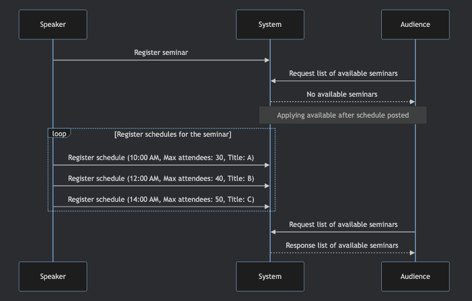
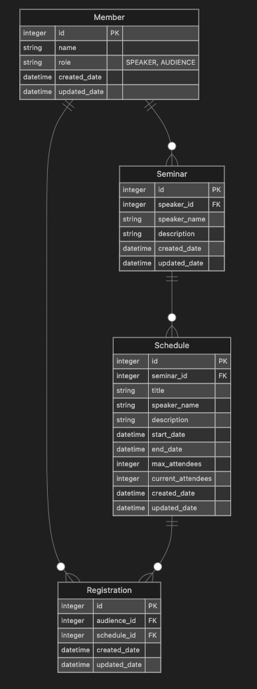

# 특강 신청 애플리케이션 비즈니스 요구사항 및 ERD 

## 비즈니스 요구사항 

### 특강 연사 (Speaker)



- ###### 특강 연사는 준비한 특강을 다양한 시간대에 걸쳐 진행할 수 있습니다. (같은 특강 내용을 여러 번에 나누어 진행하는 것에서 착안) 
  - ###### 따라서 특강 등록, 한 특강에 대한 스케줄 등록으로 나뉘고, 스케줄 등록 시점부터 청중에게 노출됩니다.  
- ###### 특강 연사는 공간 제약 등의 이유로 시간대별로 최대 정원을 설정할 수 있습니다. 
- ###### 특강 연사는 특강 진행에 따른 변화 또는 청중의 특징을 고려하여 특강의 제목을 각 시간대별로 조정할 수 있습니다.

### 수강생 (Audience)

- ###### 수강생은 신청 가능한 특강 목록을 조회할 수 있습니다.
- ###### 수강생은 신청 완료한 특강 목록을 조회할 수 있습니다.
- ###### 수강생은 동일한 특강의 각 스케줄에 대해 한 번만 신청할 수 있습니다.
- ###### 수강생은 이미 정원이 초과된 특강은 신청할 수 없습니다.
- ###### 수강생은 30분(Grace Period) 이내에 시작하는 특강은 신청할 수 없습니다. 

## ERD



### Member

- ###### id: 회원의 고유 식별자 
- ###### name: 회원의 이름
- ###### role: 회원의 역할 (SPEAKER 또는 AUDIENCE)

### Seminar

- ###### id: 특강의 고유 식별자
- ###### speaker_id: 특강을 담당하는 연사의 고유 식별자
- ###### speaker_name: 연사의 이름
- ###### description: 특강의 설명

### Registration

- ###### id: 특강 등록의 고유 식별자
- ###### audience_id: 수강생의 고유 식별자
- ###### schedule_id: 특강 일정의 고유 식별자

### Schedule

- ###### id: 일정의 고유 식별자 
- ###### seminar_id: 관련된 특강의 고유 식별자
- ###### title: 특강의 제목
- ###### speaker_name: 연사의 이름
- ###### description: 특강의 설명
- ###### start_date: 특강 시작 날짜 및 시간
- ###### end_date: 특강 종료 날짜 및 시간
- ###### max_attendees: 최대 수강 인원 수
- ###### current_attendees: 현재 등록된 수강 인원 수

## ERD 설계 배경

### Point 1: 특강의 현재 신청자 수를 매번 쿼리하는 것은 비용이 적지 않다! 별도의 컬럼으로 관리하자.  

> #### - 수강생은 신청 가능한 특강 목록을 조회할 수 있습니다.
> #### - 수강생은 이미 정원이 초과된 특강은 신청할 수 없습니다.

###### 신청 가능한 특강 목록 조회 API, 특강 신청 API 모두에서 특강의 현재 신청자 수를 계산해야 합니다. 특히 신청 가능한 특강 목록을 조회할 떄 각 특강 별로 현재 신청자 수를 별도로 계산해야 하는 점은 한 번에 읽어들이는 양에 따라 부하가 커질 수 있는 부분이라고 생각했습니다. 그리고 매우 인기가 많은 연사의 경우 현재의 동시성 제어 방식(비관적 락)에서 각 트랜잭션이 충돌할 여지가 많은데, 이런 경우 매 요청 별로 현재 신청자 수를 계산하는 시간을 줄여 락 대기 시간을 줄이는 것이 성능 차원에서도 효용이 있을 것으로 봤습니다. 따라서 Schedule 테이블에 current_attendees 컬럼을 별도로 만들어서 현재 신청자 수를 관리할 수 있도록 선택했습니다. 

### Point 2: 객체 그래프 탐색 깊이를 줄일 수 있는 방법을 고민해보자.

#### AS IS  

```java
public class RegistrationMapper {
    
  public List<RegistrationResponse> mapToRegistrationResponse(List<Registration> registrations) {
      return registrations.stream()
              .map(registration -> new RegistrationResponse(
                  registration.getSchedule().getTitle(),
                  registration.getSchedule().getSeminar().getSpeaker().getName(), // 🔴 
                  registration.getSchedule().getSeminar().getDescription(), // 🔴
                  registration.getSchedule().getStartDate(), 
                  registration.getSchedule().getEndDate()
              )).toList();
  }
}

public class ScheduleMapper {

  public List<ScheduleResponse> mapToScheduleResponse(List<Schedule> schedules) {
    return schedules.stream()
            .map(schedule -> new ScheduleResponse(
                schedule.getTitle(),
                schedule.getSeminar().getSpeaker().getName(), // 🔴
                schedule.getSeminar().getDescription(), 
                schedule.getStartDate(),
                schedule.getEndDate()
            )).toList();
  }
}
```

###### 설계한 ERD 기준으로 개발을 진행하고 나서 돌아보니, 위 예시 코드의 🔴 부분 처럼 객체 그래프 탐색이 3번 이상 일어나는 것을 발견했습니다. 표면적으로 우선 코드 가독성 측면에서도 좋지 않고, 내부적으로도 여러 테이블을 JOIN 해서 데이터를 조회해야 하므로 특히 데이터의 양이 쌓일 수록 더 부하가 커질 것으로 예상했습니다. 이런 배경에서 객체 그래프 탐색의 깊이를 얕게 유지할 수 있는 방법에 대해서 고민하게 됐습니다.

#### TO BE 

###### 결과적으로 저는 `높은 수준의 데이터 일관성`이 필요하지 않은 데이터, `유저가 자주 바꾸지 않을` 데이터에 대해서 데이터 중복을 일으켜서 객체 그래프 탐색의 깊이를 얕게 관리하는 것을 선택했습니다. 

- ###### `Semianr`.description ► `Schedule`.description
  - ###### 비즈니스 요구사항에도 언급했듯이, 하나의 특강을 여러 시간대에 진행할 수 있습니다. 특강 테이블에는 여러 스케줄에 공통된 정보가 들어가는데, 특강에 대한 소개는 특강을 등록할 때 작성한 이후 자주 바꿀 필요가 없는 데이터라고 판단했습니다. 또한 특강 신청과 관련해 주요 정보인 시간, 정원 등과 달리 내용이 일부 바뀌어도 실시간으로 데이터의 싱크를 맞출 필요까지는 없다고 판단했습니다. 따라서 데이터 변동이 있어도 배치 등을 이용해 업데이트를 해도 크게 무리가 없을 것으로 판단했고, 데이터 중복을 허용을 통해 발생하는 오버헤드 역시 어느정도 커버가능한 부분이라고 생각했습니다.

- ###### `Member`.name ► `Schedule`.speaker_name
  - ###### 연사의 이름은 유저가 자주 바뀌지 않을 데이터로 예상했습니다. 연사의 이름은 서비스 내에서 높은 수준의 일관성을 가져야 한다고 생각하지만, 상대적으로 다른 정보에 비해 자주 바꾸지 않을 데이터로 판단해서 데이터 중복을 허용했습니다. 필요 시 이름 수정 횟수를 제한하는 것도 방법이 될 수 있을 것 같습니다. (실시간 업데이트를 한다는 전제)

###### 위와 같이 데이터 중복을 의도적으로 일으켜서 아래와 같이 객체 그래프 탐색 깊이를 줄일 수 있었습니다.  

```java
public class RegistrationMapper {

  public List<RegistrationResponse> mapToRegistrationResponse(List<Registration> registrations) {
    return registrations.stream()
            .map(registration -> new RegistrationResponse(
                registration.getSchedule().getId(),
                registration.getSchedule().getTitle(),
                registration.getSchedule().getSpeakerName(), // 🔵 
                registration.getSchedule().getDescription(), // 🔵
                registration.getSchedule().getStartDate(),
                registration.getSchedule().getEndDate()
            )).toList();
  }
}

public class ScheduleMapper {

  public List<ScheduleResponse> mapToScheduleResponse(List<Schedule> schedules) {
    return schedules.stream()
            .map(schedule -> new ScheduleResponse(
                schedule.getId(),
                schedule.getTitle(),
                schedule.getSpeakerName(), // 🔵
                schedule.getDescription(), 
                schedule.getStartDate(),
                schedule.getEndDate()
            )).toList();
  }
}
```

<details>
<summary>FYI. 예약 가능한 특강 목록 조회 쿼리</summary>

#### AS IS 🔴

```sql
Hibernate: 
    select
        s1_0.id,
        s1_0.created_date,
        s1_0.current_attendees,
        s1_0.end_date,
        s1_0.max_attendees,
        s2_0.id,
        s2_0.created_date,
        s2_0.description,
        s2_0.speaker_id,
        s3_0.id,
        s3_0.created_date,
        s3_0.name,
        s3_0.role,
        s3_0.updated_date,
        s2_0.updated_date,
        s1_0.start_date,
        s1_0.title,
        s1_0.updated_date 
    from
        schedule s1_0 
    left join
        seminar s2_0 
            on s2_0.id=s1_0.seminar_id 
    left join
        member s3_0 
            on s3_0.id=s2_0.speaker_id 
    left join
        registration r1_0 
            on r1_0.schedule_id=s1_0.id 
            and r1_0.audience_id=? 
    where
        s1_0.start_date>=? 
        and s1_0.max_attendees>s1_0.current_attendees 
        and r1_0.id is null 
    order by
        s1_0.start_date desc,
        s1_0.id desc
```

#### TO BE 🔵

```sql
Hibernate: 
    select
        s1_0.id,
        s1_0.created_date,
        s1_0.current_attendees,
        s1_0.description,
        s1_0.end_date,
        s1_0.max_attendees,
        s1_0.seminar_id,
        s1_0.speaker_name,
        s1_0.start_date,
        s1_0.title,
        s1_0.updated_date 
    from
        schedule s1_0 
    left join
        registration r1_0 
            on r1_0.schedule_id=s1_0.id 
            and r1_0.audience_id=? 
    where
        s1_0.start_date>=? 
        and s1_0.max_attendees>s1_0.current_attendees 
        and r1_0.id is null 
    order by
        s1_0.start_date desc,
        s1_0.id desc
```
</details>

## 아쉬운 점

###### 실제 일정 규모의 환경에서 직접 벤치마크를 돌리지 못해 실제 효용이 있는지까지는 확인하지 못한 점이 아쉽습니다. 이 부분은 따로 진행하면서 실제 효용이 있는지 검증해보겠습니다. 😅